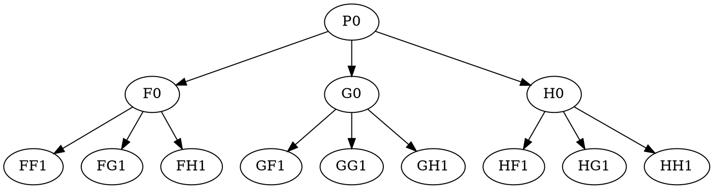

# Frac5 JS: Animated Frac5 generation using browser javascript

## Try it out!

Life flickers like an uncertain flame.  Sometimes, you just want to
eat dessert first.

[Frac5 JS](/frac5.html)

## Recap

In my [previous post](/2025-08-08-frac5.html) on
[Frac5](https://github.com/KeithFrost/frac5.git) fractal image
generation, I explained how I came around to generating a new type of
flame-like fractals using [Numerical
Elixir](https://github.com/elixir-nx), and closed that post with a
brief paragraph about future plans, in which I mentioned hoping to
explore a way to make the generation of these images more dynamic or
interactive, perhaps by using `WebGPU` in the browser.

I started looking into using `WebGPU`, and I still hope that it may
prove useful to this work in the future, but porting my `Numerical
Elixir` implementation directly to a `WebGPU` implementation seemed to
this programmer (unfamiliar with implementing shaders in general, and
the browser interfaces to doing so specifically) like a *very* steep and
rocky road.

## On wanting enchiladas

One day I was sitting on the couch at [Recurse
Center](https://recurse.com) and a friend asked how it was going, and
I ranted a bit about just how tough and complex the going was.  And
this friend said (as friends do), "let me see if I can help." They
proceeded to show my `Frac5` code to some "LLM" creature or other, and
we tried for an hour or so to help it break down the tasks needed to
rewrite `Frac5` in javascript to use GPU shaders and animate the image
generation in the browser.

The exercise was a dismal failure, which I suppose provided some
reassurance that I'm not completely incompetent, but the *process* of
the attempt got me thinking.  *Why* was it so tough?  If I wanted to
get one of these LLM monsters to do my bidding, what input would be
sufficient to allow it to be successful?

It didn't take much effort to see my way to an answer.  What made the
job tough was that we were trying to do too much all at once.  When I
developed the `Frac5` code, I didn't start by writing its final form,
Numerical Elixir and all, off the top of my head.  Of course not! That
would have been way too hard!  I started by writing a more
straightforward, less efficient, less capable version of the code, and
getting that to work.

Once I had a working version, however inefficient, incapable, and
simplistic it might be, I could make incremental steps to improve it
in chosen directions, one little change at time.  It is our
*impatience* which frustrates our efforts at coping with complexity,
more than anything.  So long as we insist on trying to have the whole
enchilada *right now*, we remain frustrated, and hungry.  If we start
looking around for some tortillas, and some cheese, and a few other
ingredients... enchiladas may well be on our plate, by and by.

## A silly javascript gadget

That's a fine analogy, but what, in this situation, are the tortillas?
That very afternoon on which our "vibe coding" hit a variety of dead
ends, I made up my mind to start writing a barebones, inefficient,
simplistic version of my `Frac5` code in plain javascript.

Hang on just a second, though.  It's all very well to have a minimal
version of a piece of code, but if I wrote an animation of this
fractal drawing process in javascript that took half an hour to run, I
wouldn't be sticking around to watch it, nor would I be able to
readily convince myself that it was worth the effort (and it *does
take effort*, perhaps especially to *rewrite* code).  So first I
needed to implement something else, even simpler, that actually ran in
the browser, and did some amount of numerical work to animate
something, so that I could benchmark it and get an idea whether my
all-javascript, all-CPU fractal animation had any hope of being
worthwhile.  My only previous experience writing computationally
intensive animations in the browser was using [p5js](pgjs.org), and I
had *not* been pleased with the performance of trying to perform ~100K
`draw` operations per animation frame in *that* environment.

So I wrote a little gadget, that just changed the RGB values of a
bunch of pixels in a canvas every animation frame, and I benchmarked
it on all the devices I had access to.  You can run the
[gadget](/play2.html) yourself, if you're curious.

It has a little bit of HTML, that just looks like this.
```html
<!DOCTYPE html>
<html>
  <body>
    <div>fps: <span id="fps"></span></div>
    <canvas id="canvas"></canvas>
    <script src="./play2d.js"></script>
  </body>
</html>
```
And that javascript file contains this.
```javascript
const canvas = document.getElementById("canvas");
const fpsElem = document.getElementById("fps");

const ctx = canvas.getContext('2d');
const pixelRatio = window.devicePixelRatio || 1;
const cssWidth = 640;
const cssHeight = 640;
canvas.style.width = cssWidth + 'px';
canvas.style.height = cssHeight + 'px';
const cWidth = Math.floor(cssWidth * pixelRatio);
const cHeight = Math.floor(cssHeight * pixelRatio);
canvas.width = cWidth;
canvas.height = cHeight;
ctx.scale(pixelRatio, pixelRatio);

const imageData = ctx.createImageData(cWidth, cHeight);
const imgData = imageData.data;   // Uint8ClampedArray

let pTime = 0.0;
let sumTime = 0.0;
let frames = 0;
function animate(time) {
    time *= 0.001;
    const deltaTime = time - pTime;
    if (pTime > 0) {
        sumTime += deltaTime;
        frames += 1;
    }
    pTime = time;
    if (sumTime >= 1.0) {
        const fps = frames / sumTime;
        fpsElem.textContent = fps.toFixed(1);
        sumTime = 0.0;
        frames = 0;
    }
    const t = Math.floor(time * 256) % 2048;
    for (let r = 0; r < cHeight; r++) {
        for (let c = 0; c < cWidth; c++) {
            index = (r * cWidth + c) * 4;
            imgData[index] = (r + t) % 256;
            imgData[index + 1] = (c + t) % 256;
            imgData[index + 2] = (index + t) % 256;
            imgData[index + 3] = 255;
        }
    }
    ctx.putImageData(imageData, 0, 0);
    requestAnimationFrame(animate);
}

requestAnimationFrame(animate);

console.log("canvas dimensions: " + canvas.width + "x" + canvas.height);
```
What does this do?  It animates lots and lots of rainbows!  And
by rainbows I mean little moving squares with colors in them.  For my
purposes, though, the only important thing that this does is draw a different
color to every single pixel in a canvas, every single animation frame,
and it runs at enough frames per second on all of my devices to
convince me that I can do enough math in javascript to smoothly
animate the rendering of very interesting fractals in just a few minutes!

## Memory optimization breakthrough

Back when I was still struggling to figure out how to animate the
`Frac5` fractals using GPU shaders, I came up with a helpful way to
visualize the computation of the 5D points that end up getting
rendered into the fractal images. Some group of points $P_0$ gets put
through multiple operations $(F_0, G_0, H_0)$, and then the points
which result from those are put through operations $(F_1, G_1, H_1)$,
and so on...  So the groups of points which come out of this process
are most readily visualized as forming a *tree*.



One night when I was riding the subway home and picturing how I might
store and process the points arising from this graph using shaders, I
had an epiphany.  You can plainly see that the number of points at
each layer of this tree grows exponentially. At first this is a very
*good* thing, because we can process all of the points at one layer of
the tree in parallel, and when you want to perform work quickly using
GPUs, the more work you can do in parallel, the better.  So growing
exponentially in this way is very good, as I said, because if we start
with five points (one for each cardinal direction in 5D, natch), and
then process those five points through nine layers of the tree, we end
up with $5 \cdot 3^9 = 98415$ points at the ninth layer, and it's
*good* to be able to hand off ~100K points to a GPU to process in
parallel.

Only, the tree doesn't stop there, no it doesn't, it goes right on
growing exponentially every layer, and we end up wanting to process
something like 16 or 17 layers of the tree, and at the 16th layer we
have $5 \cdot 3^{16} \approx 2 \cdot 10^8$ points, which when you
write them all out, 4 bytes per float, 5 dimensions per point, take up
4 GB of memory, and (in *A.D.* 2025) that size of chunk of memory
ought not to be casually allocated and passed around (perhaps
*especially* on GPUs), not to mention, *garbage collected*.

In my Elixir library, I had stopped concatenating blocks of points
from a layer together once they exceeded ~100K points, because I found
that trying to allocate and process blocks of points which were *too
large* on the GPU with Numerical Elixir started to cause performance
and stability issues with my Mac Mini.  I don't recall exactly where
the dangerous edge was, because I swiftly backed well away from it.

But when I wrote that block size limitation in my Elixir code, *I
overlooked something really important*. (Perhaps you have already seen
my mistake and are laughing up your sleeve about it, in which case --
go ahead, yuck it up! I live to give joy to clever people.) You see, I
kept my points in blocks of ~100K, but I still traversed the tree in
breadth-first order, one layer at a time.  And this meant, I still had
to store all of the points from the previous layer, until I was ready
to start processing the next layer.  And as we just saw, storing this
many points starts to add up to really big memory, even if it isn't
allocated all in one giant chunk.

That night on the subway, the realization hit me like a (forgive me)
train. Yes, for the first 9 (or however many) layers of the tree it's
best to traverse it in breadth-first order, one layer at a time,
because we want to concatenate all the points from the layer together
for parallel processing. *But once we have a chunk of points large
enough to saturate our parallel processing capability, we can traverse
the rest of the tree depth-first, and achieve exponential savings on
the memory required by the algorithm.*

To see this, refer back to the tree diagram above, but now imagine
that `P0` is a block containing all the points from 9th layer of our
tree. To traverse the pictured tree depth-first, we go to `F0`, then
to `FF1`, which we process and throw away, then `FG1` likewise, and so
on to `FH1`.  After processing those points, we can likewise throw
away `F0`, and move to processing `G0`, `GF1`, `GG1`, `GH1`.  At each
stage when we are processing a block of points, we need only keep in
memory a single stack of blocks, numbering no more than the *depth* of
the portion of the tree we are processing depth-first.

So in the case where we want to go from layer 9 to layer 16 of the
tree, we need only ever store 8 blocks of points, as compared to $3^7=
2187$ blocks which would be required to store the entire 16th layer.
This is an *enormous* savings.  It means that the number of points we
can process with the algorithm is no longer directly bound by the
memory of our computer (or GPU, or whatever), because the number of
points we need to *store* at any one time only grows as the
*logarithm* of the total number of points we wish to *process*.

## Javascript: the good parts

I didn't expect to like writing javascript much.  I was surprised.
Javascript can be a perfectly pleasant language for writing code, in a
variety of styles.  The biggest hurdle I faced was figuring out a
development flow that gave me a serviceable REPL, on code that
targeted the browser.  I ended up using the javascript notebook
environment [scribbler](https://github.com/gopi-suvanam/scribbler)
(served locally with `npx serve --cors`), and it worked well enough.

I'm just going to show some highlights of the code in this post. The
current state of it is not a production library; it's all in one file,
and subject to breaking changes, but you can read the full source
[here](https://github.com/KeithFrost/KeithFrost.github.io/blob/main/docs/frac5.js).

This is how I create a (randomized) affine transformation.  Note how
easy it is, in javascript, to create and return a closure.

```javascript
function boxMuller() {
    let u1 = 0;
    let u2 = 0;

    while (u1 == 0) u1 = Math.random();
    while (u2 == 0) u2 = Math.random();

    return Math.sqrt(-2.0 * Math.log(u1)) * Math.cos(2.0 * Math.PI * u2);
}

const pi4 = 4.0 * Math.PI;
const pi2 = 2.0 * Math.PI;
const pi10 = 10.0 * Math.PI;

function makeAffine(scale) {
    const matrix = new Float32Array(5 * 5);
    for (let i = 0; i < 5; i++) {
        for (let j = 0; j < 5; j++) {
            const index = i * 5 + j;
            matrix[index] = scale * boxMuller();
        }
    }

    return (p5s) => {
        const t5s = new Float32Array(p5s.length);
        for (let pp = 0; pp < p5s.length; pp += 5) {
            for (let i = 0; i < 5; i++) {
                const indT = pp + i;
                for (let j = 0; j < 5; j++) {
                    t5s[indT] += matrix[i * 5 + j] * p5s[pp + j];
                }
                t5s[indT] = (t5s[indT] + pi10) % pi4 - pi2
            }
        }
        return t5s;
    }
}
```

Here's how I return a closure which maps a function supplied as an
argument over a `Float32Array`.  Nice!

```javascript
function f32map(f) {
  return (p5s) => {
    const t5s = new Float32Array(p5s.length);
    for (let index = 0; index < p5s.length; index++) {
        t5s[index] = f(p5s[index]);
    }
    return t5s;
  }
}
```

And here is concatenating an array of `Float32Array`s.  It gets the
job done, without much fuss.

```javascript
function concatenate(arrayP5s) {
    let length = 0;
    for (const p5s of arrayP5s) {
        length += p5s.length;
    }
    const t5s = new Float32Array(length);
    let offset = 0;
    for (const p5s of arrayP5s) {
        t5s.set(p5s, offset)
        offset += p5s.length;
    }
    return t5s;
}
```

Finally, I want to show how the depth first traversal works, without
getting too deep into the implementation weeds.  So here is just part
of the implementation of the `Frac5State` class.

```javascript
class FracState {
  constructor(seqTxs, parTxs, res, imgBuff, zcolor) {
	this.seqTxs = seqTxs;
	this.parTxs = parTxs;
	this.res = res;
	this.imgBuff = imgBuff;
	this.zcolor = zcolor;

	let pts = new Float32Array(5 * 5);
  	for (let i = 0; i < 25; i += 6) {
		pts[i] = 1.0;
  	}
	let l = 0;
  	while (pts.length < 250000) {
		pts = concatenate(parTxs.map((tx) => tx(pts)));
		pts = seqTxs[l % seqTxs.length](pts);
	  	l++;
  	}
	this.p0 = pts;
	this.l0 = l;
	this.ptStack = [];
	this.iTxStack = [];

	this.counts = new Int32Array(res * res);
	this.pixelSums = new Float32Array(res * res * 3);

	this.maxDepth = Math.floor(Math.log(3.0E8) / Math.log(parTxs.length)) - l;
  };

  proc1() {
	let depth = this.iTxStack.length;
	if (depth < this.maxDepth) {
	  depth++;
	  this.iTxStack.push(0);
	  const p0 = (depth > 1) ? this.ptStack.at(-1) : this.p0;
	  this.ptStack.push(this.seqTxs[(this.l0 + depth) % this.seqTxs.length](this.parTxs[0](p0)))
	  return true;
	} else {
		while (this.iTxStack.at(-1) == this.parTxs.length - 1) {
		  this.iTxStack.pop()
		  this.ptStack.pop()
		  depth--;
		}
		if (depth == 0) return false;  // We've generated all the points we can up to this.maxDepth
		const itx = this.iTxStack.pop() + 1;
		this.ptStack.pop();
		const p0 = (depth > 1) ? this.ptStack.at(-1) : this.p0;
		this.ptStack.push(this.seqTxs[(this.l0 + depth) % this.seqTxs.length](this.parTxs[itx](p0)));
	  	this.iTxStack.push(itx);
		return true;
	}
  }
```

The initial layers of the computation tree are computed in the
constructor, in breadth-first order, concatenating each layer together
into a single `Float32Array`, until the size of the layer becomes
large enough that we wish to switch to depth-first evaluation.  Then
that block of points is stored as `p0`, to be used as needed by the
`proc1` method, which just computes the next block of points as it
performs a step in the depth-first traversal of the tree.  There are
two stacks which are kept synchronized: `ptStack` contains the blocks
of points we need to retain, while `iTxStack` keeps track of the
indices of the parallel operations which were used to create those
blocks of points, so we can move on to the next operation (or know
that we're all done), as needed.  The `proc1` method returns `true`
when it has successfully generated the next block of points, or
`false` when the traversal of the tree to `maxDepth` has completed.


## Tweaking the animation

Once I had the original algorithm ported to run in animated fashion in
the browser, it was only natural that I would want to modify the
algorithm to make it look better when animated.  In particular, I
observed that the original `Frac5` algorithm revisits the same pixels,
near the center of the image, an *enormous* number of times in the
course of generating the image, while touching more remote pixels far
more rarely.  It's not clear how much this feature of the algorithm
can be altered without running into other problems, but once a pixel
has accumulated so many points that each update makes only negligible
changes in its value, it's not much fun to watch an animation where
nothing changes.

So I opted to give later points some precedence over earlier points,
when updating a pixel which has already accumulated more than some
limit.  In particular, the update rule for a pixel $P$ upon
accumulating the $n$th point $p_n$ can be written

$$ P_{n} = (1 - f(n)) P_{n-1} + f(n) p_n, \; n = 1, 2, 3, ...$$

If we wish the accumulator $P$ to obtain the average value of the
points $p_i$, then we set $f(n) = 1/n$.  But I found a more
interesting animation obtained when I instead chose

$$
f(n) = \begin{cases}
    1/(n + n_0) & \text{ if } n < L \\
    1/(L + n_0) & \text{ if } n \geq L
\end{cases}
$$

which lowered the initial update weights, effectively biasing the
average downwared with $n_0$ initial zero values, and then limited the
shrinking of the update weight to some lower bound, and hence gave
later points higher precedence when there were a large number of
points.

I also slightly modified my choice of non-linear functions to
apply, biasing toward functions which increased the deviation of
points from the origin, in order to make the animation more
interesting.

## Future work

There are many ways to extend this work.  For one, with a working
in-browser animated version of the code in hand, it should now be
feasible (perhaps with some LLM assistance?) to figure out how to make
some GPU shaders do at least some of the work, which would help cool
down those CPUs and save those batteries.

But also, an animated version running in the user's web browser raises
new questions and possibilities, _e.g._ what if the user could
interact with the rendering in progress, and somehow modify its flow?
How might we take a user action as signifying some kind of preference,
and translate that into the space of our matrices, so that we would
know how to modify them?  Or, thinking more practically, how might we
allow the user to specify what non-linear functions to apply
(currently hard-coded)?  Or what color space to use (currently
randomized on reload)?

Not to mention, now I need to go back and fix my original `Frac5`
Elixir library to perform depth-first traversal of the latter layers
of the computation tree...
